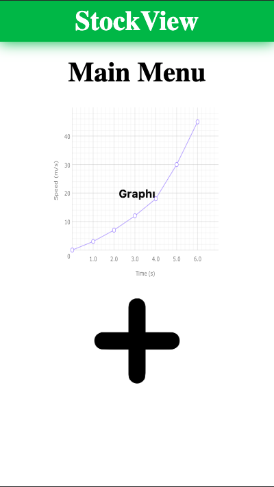
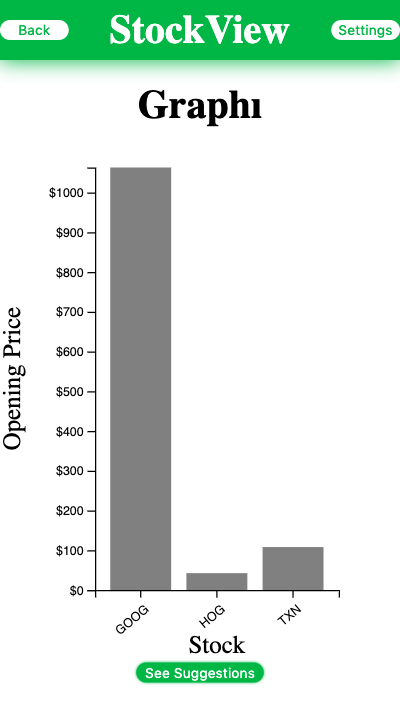
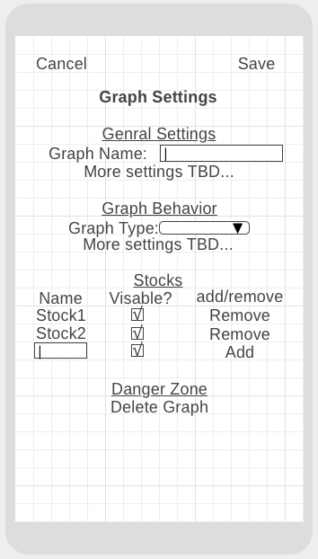
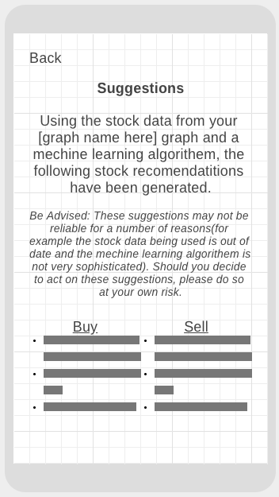

# Stock_App_Frontend
This is frontend that I'm using as a side project to learn about the stock market and the basics of building graphs with D3. Eventually I plan to build a backend api to generate suggestions on what stock should be sold or bought. This backend will be intended as a way for me to learn how to make mechine learning algorithms using django (I had no knowledge of these technologies prior to starting this project). I have no ambition for this app outside of it being a tool for learning new technologies. Below are some screenshots of the wire frames I'm using to plan how the interface for the app will look on a mobile divice:

 

